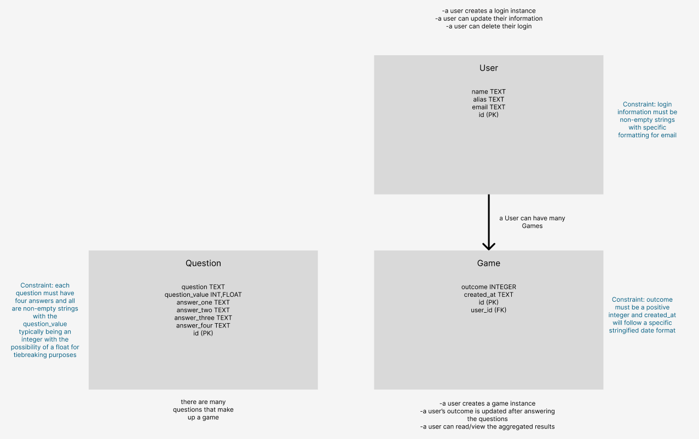
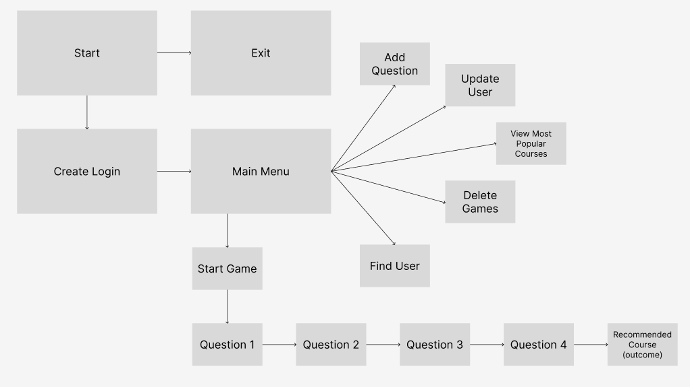
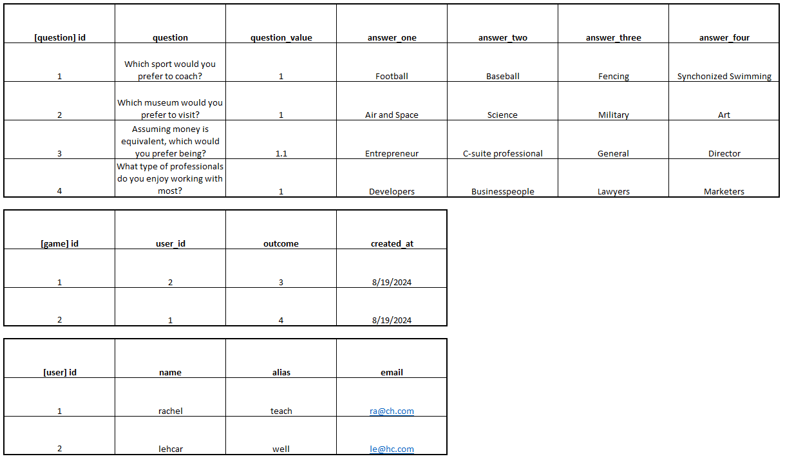
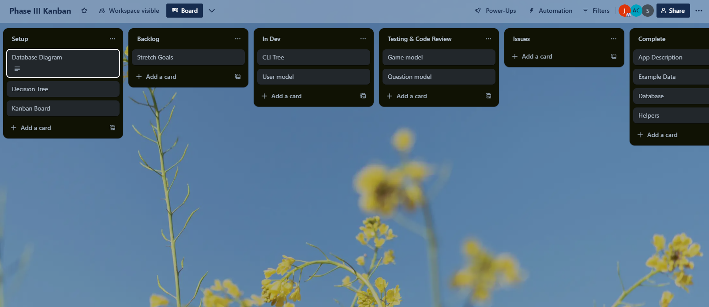

# Welcome to ClassyChoices
## Enjoy choosing your future

# Phase-3-062424-Project_Group_1
Phase 3 - Week 9 Group Project - Group 1

## Setup
- [ ] Fork
- [ ] Clone
- [ ] Navigate to the directory
- [ ] Enter pipenv install
- [ ] Enter pipenv shell
- [ ] Enter python lib/cli.py
- [ ] Enter 1 to seed default questions
- [ ] Enter 2 to play take the quiz
- [ ] Enter 3 to view the most popular courses
- [ ] Enter 0 to exit, but why would you ever want to stop playing?

# SE-EAST-Phase-3-062424
## Project Requirements
- [ ] A one sentence description of your CLI.
- [ ] A description / diagram of your database including relationships, constraints, intended CRUD actions.  This should not be code.  It needs to be something visual.
- [ ] A decision tree of the flow of your CLI.  Preferably a screenshot of a drawio diagram.
- [ ] An example of your data.
- [ ] Three stretch goals in case you finish your MVP by the due date
- [ ] A kanban board showing how you will be dividing tasks among partners

## CLI Description
- [ ] Our CLI will present a series of questions to users and depending on the answers to these questions, the CLI will provide the current user a recommended course in which to enroll.

## Database Diagram
- [ ] 

## Decision Tree (screenshot)
- [ ] 

## Example Data
- [ ] 

## Three Stretch Goals
- [ ] Color/format CLI text
- [ ] Allow users to add questions
- [ ] Automate extra question content

## Kanban Board
- [ ] https://trello.com/b/xArbcXiP/phase-iii-kanban
- [ ] 